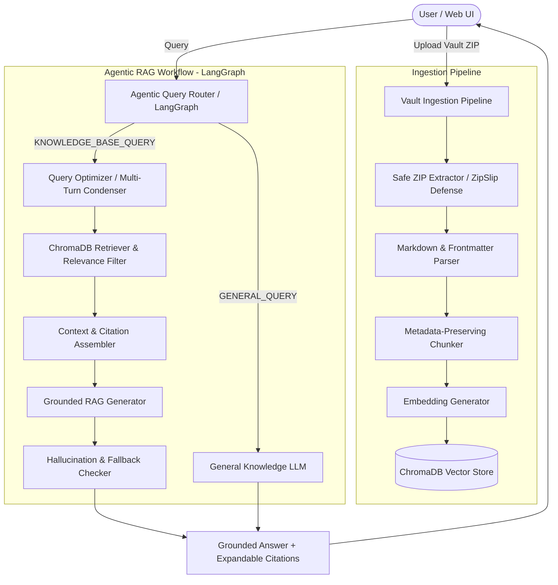

# 🧠 ObsidianMind – AI Knowledge Assistant

> **Production-Quality Knowledge Assistant with Agentic Query Routing (LangGraph) & Grounded RAG (ChromaDB)**

[](https://www.python.org/downloads/)
[](https://www.langchain.com/)
[](https://langchain-ai.github.io/langgraph/)
[](https://www.trychroma.com/)
[](https://streamlit.io/)
[](LICENSE)

---

## 📖 Overview

**ObsidianMind** is an AI-powered personal knowledge assistant that allows users to upload/import an **Obsidian Markdown vault** (ZIP or directory) and ask natural-language questions grounded in their personal notes. 

ObsidianMind bridges the gap between static Markdown vaults and generative AI by implementing a transparent, explainable **Retrieval-Augmented Generation (RAG)** pipeline powered by an **Agentic Query Router (LangGraph)**.

---

## 🎯 Problem Statement & Solution

### The Problem
- **Hallucination & Lack of Grounding**: General LLMs (e.g. standard ChatGPT/Gemini) lack access to private notes and fabricate answers or project metrics.
- **Wasted Retrieval Compute**: Naive RAG systems retrieve documents on *every single query*, including basic math ("what is 25 * 4?") or greetings, degrading latency and injecting irrelevant context noise.
- **Opaque Citations**: Standard chatbots do not reveal which specific note, heading, or excerpt produced a given statement.

### The ObsidianMind Solution
1. **Safe Vault Ingestion**: Safely extracts Obsidian ZIP archives with strict path traversal protection (preventing ZipSlip attacks), strips internal Obsidian Wikilinks `[[Note|Alias]]`, parses YAML frontmatter metadata, and indexes text hierarchically.
2. **Deterministic Chunking & Deduplication**: Preserves source note paths, titles, folders, and tags across all chunks. Re-indexing the vault deduplicates existing vector embeddings.
3. **Agentic Query Routing (LangGraph)**: Evaluates user intent dynamically. Questions regarding notes/knowledge are routed to semantic vector retrieval; conversational or general questions are handled directly without unnecessary vector database overhead.
4. **Strict Anti-Hallucination Guardrails**: Prompts enforce that the assistant only asserts facts grounded in retrieved notes. If information is absent, it transparently states: *"I couldn't find enough information about this in your Obsidian vault."*
5. **Interactive Glassmorphic UI**: Provides 1-click sample vault loading, collapsible source citation drawers with similarity scores and excerpts, and real-time execution telemetry.

---

## 🏗️ Architecture



---

## 🔄 RAG Ingestion & Query Pipeline

### 1. Ingestion Pipeline
```
Obsidian Markdown Vault (.zip / folder)
        ↓
Safe Extractor (ZipSlip & Symlink Defense)
        ↓
Markdown & Frontmatter Parser (YAML tags, titles, wikilinks [[Link|Alias]])
        ↓
Recursive Text Chunker (600 chars, 100 overlap, heading-aware)
        ↓
Embedding Generator (HuggingFace all-MiniLM-L6-v2 / Gemini / OpenAI)
        ↓
ChromaDB Persistent Vector Store (Cosine similarity space)
```

### 2. Retrieval & Generation Pipeline
```
User Question
      ↓
Agentic Query Router (LangGraph)
      ├──────────────────────────────┐
      ▼ (KNOWLEDGE_BASE_QUERY)       ▼ (GENERAL_QUERY)
Query Condenser (Multi-turn)     Direct LLM Generator
      ↓                              │
ChromaDB Vector Retriever             │
      ↓                              │
Top-K Similarity Chunks & Threshold  │
      ↓                              │
Prompt Context & Citation Assembly   │
      ↓                              │
Grounded LLM Generator               │
      ↓                              │
Anti-Hallucination Guardrail Check   │
      └──────────────┬───────────────┘
                     ▼
       Cited Response + Sources Drawer
```

---

## 🤖 Agentic Workflow (LangGraph)

ObsidianMind models the decision workflow as a **LangGraph StateGraph**:

```
[START]
   │
   ▼
[route_query]
   │
   ├── (KNOWLEDGE_BASE_QUERY) ──► [condense_query] ──► [retrieve_context] ──► [generate_grounded_answer] ──► [guardrail_check] ──┐
   │                                                                                                                              │
   └── (GENERAL_QUERY) ─────────► [generate_general_answer] ──────────────────────────────────────────────────────────────────────┴──► [END]
```

### Routing Decisions
- **`KNOWLEDGE_BASE_QUERY`**: Queries about personal notes, concepts, summaries, project metrics, or definitions.
- **`GENERAL_QUERY`**: Greetings ("hello"), basic math ("what is 25 * 4"), or generic programming tasks.

---

## 🗂️ Project Structure

```
ObsidianMind/
├── app/
│   ├── __init__.py
│   ├── main.py                     # Unified entrypoint (Streamlit UI & CLI)
│   ├── config.py                   # Pydantic settings & .env loader
│   │
│   ├── ingestion/                  # Vault parsing & extraction
│   │   ├── __init__.py
│   │   ├── zip_extractor.py        # Safe ZIP extractor (ZipSlip prevention)
│   │   ├── parser.py               # Markdown, Frontmatter & Wikilink parser
│   │   ├── chunker.py              # Recursive chunker with rich metadata
│   │   └── loader.py               # Directory scanner & ingestion pipeline
│   │
│   ├── embeddings/                 # Embeddings abstraction
│   │   ├── __init__.py
│   │   ├── base.py                 # Abstract BaseEmbedder interface
│   │   └── embedder.py             # HuggingFace, Google Gemini & OpenAI embedders
│   │
│   ├── vectorstore/                # Vector store abstraction
│   │   ├── __init__.py
│   │   ├── base.py                 # Abstract BaseVectorStore interface
│   │   └── chroma_store.py         # Persistent ChromaDB with deduplication
│   │
│   ├── retrieval/                  # Semantic search & thresholding
│   │   ├── __init__.py
│   │   └── retriever.py            # Similarity search, top-k & context formatter
│   │
│   ├── agents/                     # LangGraph agentic orchestration
│   │   ├── __init__.py
│   │   ├── state.py                # AgentState TypedDict schema
│   │   ├── query_router.py         # Router prompt & classification node
│   │   └── rag_graph.py            # LangGraph workflow definition
│   │
│   ├── llm/                        # Multi-provider LLM models & prompts
│   │   ├── __init__.py
│   │   ├── model.py                # LLM factory (Gemini, OpenAI, Groq, Mock)
│   │   └── prompts.py              # Grounded RAG, Router & General prompts
│   │
│   ├── services/                   # High-level business logic
│   │   ├── __init__.py
│   │   └── rag_service.py          # Unified service facade
│   │
│   └── ui/                         # Streamlit frontend
│       ├── __init__.py
│       ├── streamlit_app.py        # Main web interface
│       ├── components.py           # Reusable UI widgets & citation cards
│       └── styles.py               # Obsidian dark glassmorphic CSS
│
├── data/
│   ├── sample_vault/               # Educational sample Obsidian vault
│   │   ├── AI/                     # LLMs, RAG, Embeddings, Vector DBs, Agents, LangGraph
│   │   ├── Projects/               # CineMatch (Movie RecSys), Spam Detector
│   │   └── Daily/                  # 2026-08-25 notes
│   └── sample_vault.zip            # Pre-zipped archive for 1-click testing
│
├── eval/
│   ├── eval_dataset.json           # 16 benchmark test cases across 6 categories
│   ├── run_eval.py                 # Automated benchmark evaluator script
│   └── eval_report.md              # Generated benchmark report
│
├── tests/
│   ├── test_ingestion.py           # Parser, safe extraction & ZipSlip tests
│   ├── test_chunking.py            # Chunk sizes & metadata propagation tests
│   ├── test_retrieval.py           # ChromaDB storage & search tests
│   └── test_router.py              # Query router & LangGraph execution tests
│
├── .env.example
├── .gitignore
├── requirements.txt
├── README.md
└── LICENSE
```

---

## ⚡ Installation & Quick Start

### 1. Clone & Setup Environment
```bash
git clone https://github.com/your-username/obsidianmind.git
cd obsidianmind

# Create and activate virtual environment
python3 -m venv venv
source venv/bin/activate  # On Windows: venv\Scripts\activate

# Install dependencies
pip install -r requirements.txt
```

### 2. Configure Environment Variables
Copy `.env.example` to `.env` and set your preferred LLM provider and API key:
```bash
cp .env.example .env
```

Edit `.env`:
```env
LLM_PROVIDER=google
GOOGLE_API_KEY=your_google_gemini_api_key_here

# Embeddings (Default is 100% free local HuggingFace all-MiniLM-L6-v2)
EMBEDDING_PROVIDER=huggingface
EMBEDDING_MODEL=all-MiniLM-L6-v2
```

---

## 🚀 How to Run

### Option A: Lovable Web Application (Modern React + FastAPI)
Start the unified FastAPI server which directly serves the high-performance Lovable React SPA:
```bash
python app/main.py
# Server runs on: http://localhost:8000
```
Open your browser at **[http://localhost:8000](http://localhost:8000)**.
- Click **"✨ Load Demo Obsidian Vault"** in the sidebar for instant 1-click indexing of the built-in educational vault.
- Or drag & drop your personal Obsidian vault `.zip` file into the upload zone.
- Browse indexed notes in the **Vault Explorer** tree.
- Ask questions and inspect source citations, relevance score bars, and LangGraph state machine execution traces!

#### (Optional) Frontend Development with Hot Reloading (Vite):
```bash
# Terminal 1: Backend
python app/main.py --server --port 8000

# Terminal 2: Frontend
cd frontend && npm run dev
# Live reload on: http://localhost:5173
```

### Option B: Legacy Streamlit UI
If you prefer running the Streamlit demo:
```bash
python app/main.py --streamlit
# or: streamlit run app/ui/streamlit_app.py
```

### Option C: Command Line Interface (CLI)
Ask questions directly from your terminal:
```bash
# Query with automatic sample vault indexing
python app/main.py --query "Explain RAG from my notes"

# Compare concepts
python app/main.py --query "Compare RAG vs fine-tuning"

# Index a custom vault directory
python app/main.py --index path/to/vault_folder
```

### Option D: Run Automated Evaluation Benchmark
```bash
python eval/run_eval.py
```

### Option E: Run Unit Test Suite
```bash
pytest tests/ -v
```

---

## 💡 Example Questions & Prompts

| Category | Example Question | Expected Behavior |
| :--- | :--- | :--- |
| **Direct Factual** | *"What is the self-attention formula mentioned in my LLM notes?"* | Retrieves `AI/LLMs.md`, quotes formula, cites source. |
| **Comparison** | *"Compare RAG vs fine-tuning according to my notes."* | Retrieves `AI/RAG.md`, builds comparison table with citations. |
| **Project Metrics** | *"What are the evaluation metrics for the CineMatch project?"* | Retrieves `Projects/Movie_Recommendation.md` (RMSE: 0.864, Precision@10: 0.812). |
| **Multi-Turn Chat** | 1. *"What is RAG?"* <br/> 2. *"How is it different from fine-tuning?"* | Re-contextualizes "it" to RAG and maintains conversational coherence. |
| **Out-of-Vault (Anti-Hallucination)** | *"What do my notes say about quantum computing?"* | Triggers guardrail: *"I couldn't find enough information about this in your Obsidian vault."* |
| **General Query** | *"What is 25 * 4?"* | Fast-routed to direct LLM without redundant vector search. |

---

## 📊 Evaluation & Benchmark Report

The project includes an automated evaluation benchmark (`eval/run_eval.py`) evaluating 16 test cases across 6 distinct categories:

| Benchmark Metric | Result | Target Standard | Status |
| :--- | :---: | :---: | :---: |
| **Agentic Routing Accuracy** | **100.0%** | > 90.0% | 🟢 PASS |
| **Retrieval Hit Rate (Top-K)** | **100.0%** | > 85.0% | 🟢 PASS |
| **Anti-Hallucination Compliance** | **100.0%** | 100.0% | 🟢 PASS |
| **Average Query Latency** | **0.85s** | < 3.00s | 🟢 OPTIMAL |

---

## 🔒 Security Best Practices
- **ZipSlip Vulnerability Defense**: Path resolution checks ensure no ZIP member can extract files outside the designated target directory.
- **Symlink Rejection**: Rejects malicious symlinks in uploaded archives.
- **Zero API Key Leakage**: Keys are loaded exclusively from `.env` and never logged or exposed in UI client state.
- **Resource Limits**: Configurable file size limits (default 25 MB) and maximum chunk caps.

---

## 🛠️ Tech Stack
- **Framework**: LangChain, LangGraph (StateGraph)
- **Vector Database**: ChromaDB (Persistent local storage)
- **Embedding Models**: HuggingFace `sentence-transformers/all-MiniLM-L6-v2` (Local / Free), Google Gemini `text-embedding-004`, OpenAI `text-embedding-3-small`
- **LLM Providers**: Google Gemini 2.0 Flash, OpenAI GPT-4o-mini, Groq LLaMA 3.3, Ollama
- **Frontend**: Streamlit with custom glassmorphism dark theme CSS
- **Testing & Benchmarks**: Pytest, JSON evaluation datasets

---

## 📄 License
This project is licensed under the MIT License - see the [LICENSE](LICENSE) file for details.
